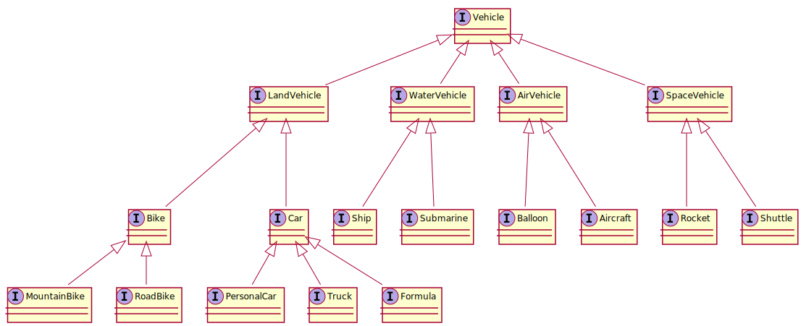

#Parametric Types 
Parametric types (generics) gives to us powerful mechanism for algorithmic abstraction.
Collection is an "box" having things and the parameter is a `type` of that thing. 
Let show an example:

```Scala
sealed abstract class List[+A] extends AbstractSeq[A]
                                  with LinearSeq[A]
                                  with Product
                                  with GenericTraversableTemplate[A, List]
                                  with LinearSeqOptimized[A, List[A]] { ...

```

```tut
1::2::3::Nil
```  
  
### Parametric types Inference
Let define our hierarchy :


### Parametric types Constraints
For class `X, Y` denote `X <: Y` when `X` is subclass of `Y`, or `Y >: X` if `Y` is superclass of `X`.

`compilation Ok:`

```tut
import jubu._
case class LunchPad[T <: SpaceVehicle](val v:T)
val lp = LunchPad(new SoyuzTM)
println("Nazdar Matus")
```

`Constraints violation, compilation failed :`

```tut
import jubu._
case class LunchPad[T <: SpaceVehicle](val v:T)
val lp = LunchPad(new ScottGenius40)
```
