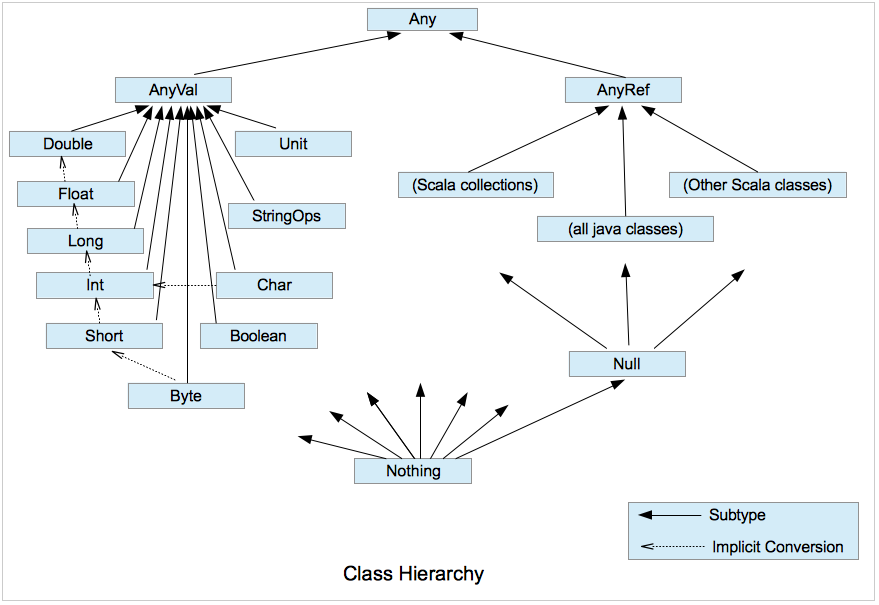

# Type Hierarchy

image credits: [http://meetfp.com] 
Remarks:
1. `StringOpts` - This class serves as a wrapper providing Strings with all the operations found in indexed sequences. Where needed, instances of String object are implicitly converted into this class.
2. `AnyRef` - Same as `Object` in Java
3. `Nothing` - Last "child" 

